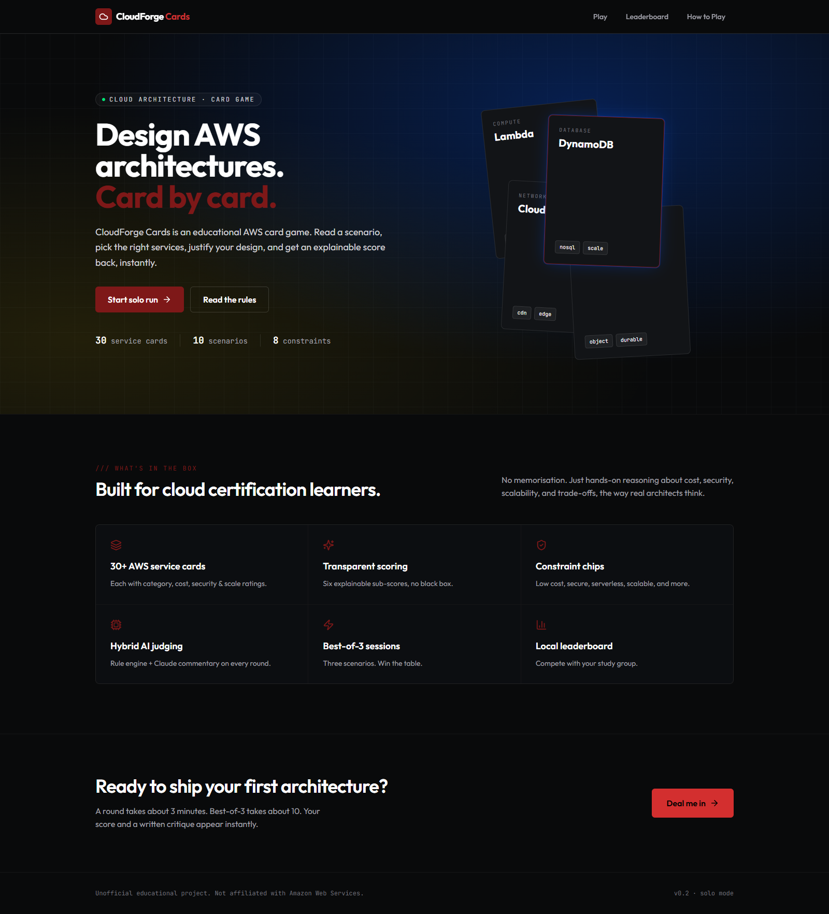
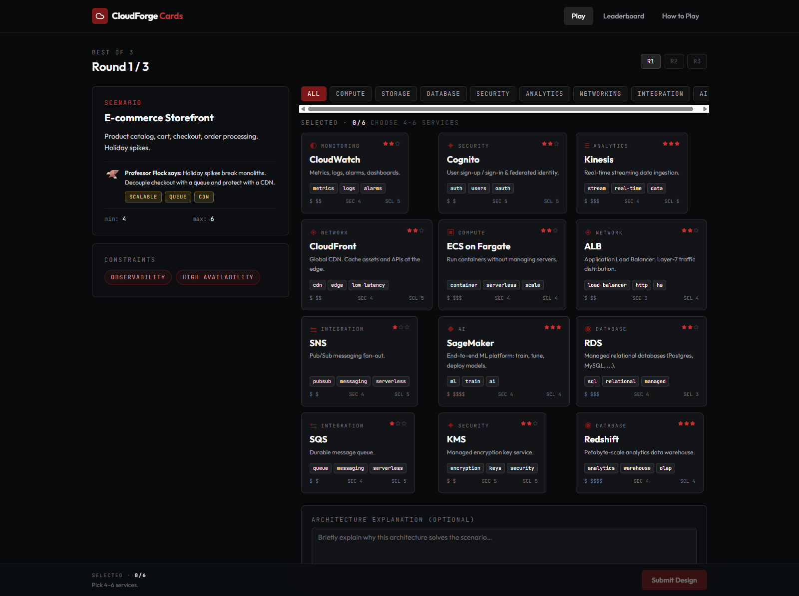
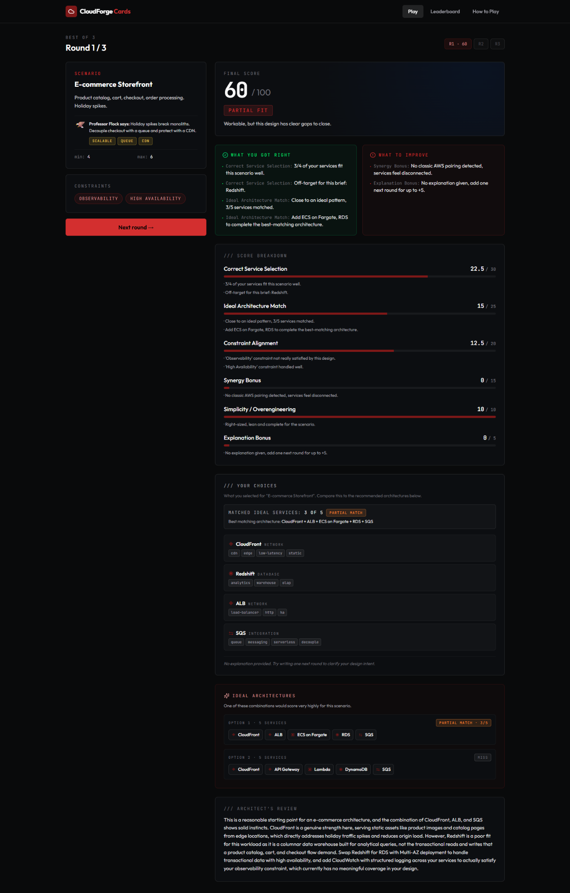
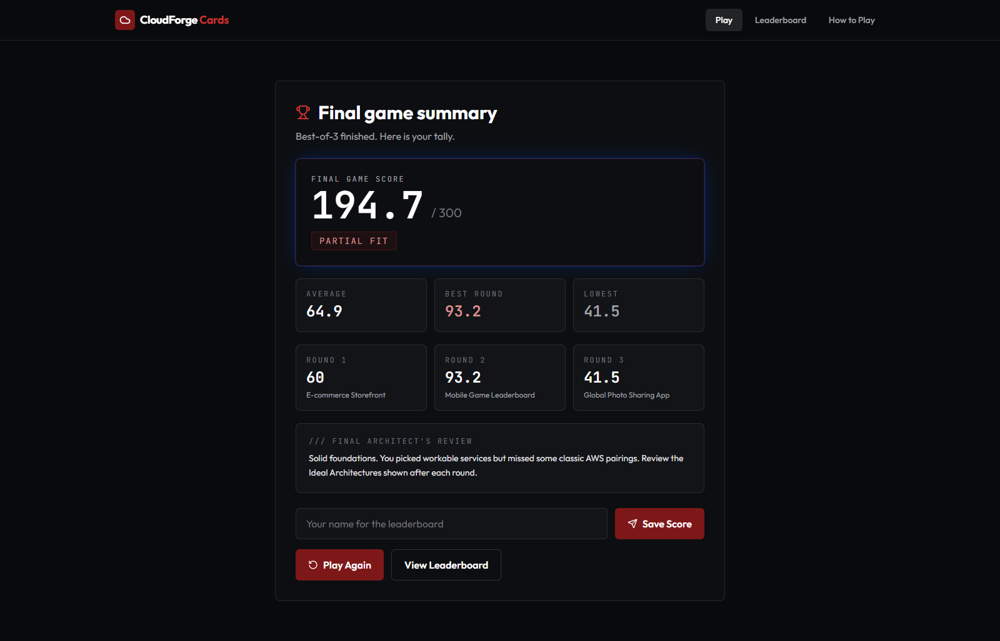

# CloudForge Cards

A gamified AWS architecture trainer where players solve cloud architecture scenarios by selecting AWS service cards, matching constraints, and receiving explainable scoring feedback.

---

<<<<<<< HEAD
**Live Demo:** [https://cloudforge-cards.emergent.host/](https://cloudforge-cards.emergent.host/)

**Demo Status:** Live demo available. Deployed via the Emergent platform. See [docs/aws-deployment-options.md](docs/aws-deployment-options.md) for the planned AWS-native deployment path.
=======
## Live Demo

**Try it now:** [https://cloudforge-cards.emergent.host/](https://cloudforge-cards.emergent.host/)

No login required. Play a full 3-round session, view your score breakdown, and land on the leaderboard.

---

## Current Release

**CloudForge Cards v0.2.5: Scoring Fairness Release**

The scoring engine is transparent, rule-based, and fair. Six sub-scores total up to 100 points with guardrails ensuring ideal architectures always score well. Every point is explainable.

---

## Screenshots

Screenshots will be added to [`docs/screenshots/`](docs/screenshots/README.md) as they are captured from the live deployment. Planned captures include the landing page, deal phase, card selection, score breakdown, leaderboard, and mobile view.
>>>>>>> origin/main

---

## Features

- 30 AWS service cards across 9 categories (Compute, Storage, Database, Network, Security, Analytics, Integration, Monitoring, AI)
- 10 real-world cloud architecture scenarios with varying difficulty
- 8 constraint chips that shape design decisions (Low Cost, High Availability, Serverless, Secure, Scalable, Beginner Friendly, Low Latency, Observability)
- Transparent, rule-based scoring engine with six explainable sub-scores
- Synergy detection for well-known AWS service pairings
- Ideal architecture matching with guardrails for fairness
- Optional LLM-powered commentary via Claude for personalized feedback
- Leaderboard with persistent high scores
- Dark theme "cloud lab" UI with tactile card interactions

## Gameplay Overview

1. **Deal Phase:** Each round, you receive a scenario prompt, constraint chips, and a hand of service cards. The hand always contains at least one ideal architecture combination.
2. **Build Phase:** Select 3 to 6 service cards to build your architecture. Consider the scenario requirements and active constraints.
3. **Explain Phase:** Optionally write a short rationale for your design choices (up to +5 bonus points).
4. **Score Phase:** The engine evaluates your selection across six dimensions and provides a detailed breakdown plus commentary.
5. **Session:** A full game session consists of 3 rounds with unique scenarios. Your total score lands on the leaderboard.

## Screenshots

### Landing Page



### Round 1: Play Screen



### Score Breakdown



### Final Game Summary



### Leaderboard


These screenshots show a manual QA solo run used to verify gameplay, scoring behavior, final summary, and leaderboard flow. The different scores are test examples across scenarios and should not be interpreted as a formal assessment of the creator's AWS knowledge.

See the [full screenshot set in docs/screenshots](docs/screenshots).

---

## Scoring Overview

The scoring engine (v0.2.5) evaluates each round on a 100-point scale across six sub-scores:

| Sub-Score | Max Points | What It Measures |
|-----------|-----------|-----------------|
| Correct Service Selection | 30 | Are the chosen services appropriate for the scenario? |
| Ideal Architecture Match | 25 | How close to a known textbook architecture? |
| Constraint Alignment | 20 | How well does the design satisfy active constraints? |
| Synergy Bonus | 15 | Bonus for well-known AWS service pairings |
| Simplicity / Overengineering | 10 | Right number of services, no bloat |
| Explanation Bonus | 5 | Clear written design rationale |

**Rating tiers:**
- 86+: Well-Architected
- 71-85: Production Candidate
- 51-70: Partial Fit
- 31-50: Needs Refactor
- 0-30: Broken Architecture

**Fairness guardrails:** A full ideal match with no distractors scores at least 85. A full ideal match with one reasonable extra service scores at least 78.

## Tech Stack

**Backend:**
- Python 3.11+
- FastAPI
- MongoDB (via Motor async driver)
- Pydantic v2 for data validation
- Optional: emergentintegrations + Claude Sonnet for LLM commentary

**Frontend:**
- React 19
- Tailwind CSS 3.4
- Radix UI primitives (via shadcn/ui)
- Framer Motion for animations
- Axios + TanStack React Query for data fetching
- CRACO build configuration

## Local Setup Instructions

### Prerequisites

- Python 3.11 or later
- Node.js 18+ and Yarn
- MongoDB instance (local or cloud)

### Backend

```bash
cd backend
python -m venv venv
source venv/bin/activate  # Windows: venv\Scripts\activate
pip install -r requirements.txt

# Create .env file with required variables
cat > .env << EOF
MONGO_URL=mongodb://localhost:27017
DB_NAME=cloudforge_cards
CORS_ORIGINS=http://localhost:3000
# Optional: EMERGENT_LLM_KEY=your_key_here
EOF

# Start the server
uvicorn server:app --reload --port 8000
```

### Frontend

```bash
cd frontend
yarn install
yarn start
```

The frontend runs on `http://localhost:3000` and proxies API requests to the backend on port 8000.

## Testing Instructions

### Backend Tests

```bash
cd backend
python -m pytest tests/ -v
# Or run the scoring acceptance tests directly:
python -m tests.test_scoring
```

See [docs/testing.md](docs/testing.md) for the full QA checklist and known issues.

### Frontend

```bash
cd frontend
yarn test
```

## Roadmap

See [docs/roadmap.md](docs/roadmap.md) for the full version plan.

**Near-term (v0.2.6):** US English copy sweep, unique leaderboard names, suggested names when taken, optional audio toggle, service-card tooltips, move "not core to scenario" feedback to What To Improve, shareable result card
**Mid-term (v0.3):** CLF Mode, SAA Mode, Obsidian note integration, more scenarios
**Long-term (v0.4+):** AWS-native deployment, Bedrock-enhanced AI feedback

## Project Structure

```
cloudforge-cards/
  backend/
    server.py          # FastAPI application and routes
    game_engine.py     # v0.2.5 scoring engine (6 sub-scores)
    seed_data.py       # Service cards, scenarios, constraints, synergies
    commentary.py      # LLM commentary layer (Claude Sonnet)
    tests/             # Backend test suite
  frontend/
    src/
      App.js           # Main application router
      components/      # React components (ServiceCard, ScoreBreakdown, Nav, etc.)
    public/            # Static assets
  docs/                # Documentation
  obsidian-export/     # Starter Obsidian notes for AWS CLF study
```

## Documentation

- [Style Guide](docs/style-guide.md)
- [Roadmap](docs/roadmap.md)
- [Testing](docs/testing.md)
- [AWS Deployment Options](docs/aws-deployment-options.md)
- [CLF Knowledge Integration](docs/clf-knowledge-integration.md)
- [Content Pipeline](docs/content-pipeline.md)
- [Release Notes: v0.2.5](docs/release-notes/v0.2.5.md)
- [Screenshots](docs/screenshots/README.md)

## Disclaimer

Unofficial educational project. Not affiliated with Amazon Web Services or North Carolina Central University.

## Attribution

Some AWS Cloud Practitioner study organization was informed by public learning resources, including the [kananinirav AWS Certified Cloud Practitioner Notes](https://github.com/kananinirav/AWS-Certified-Cloud-Practitioner-Notes) repository, but CloudForge Cards uses original synthesized explanations, scenarios, and game content.

## License

This project is for educational and portfolio purposes.
