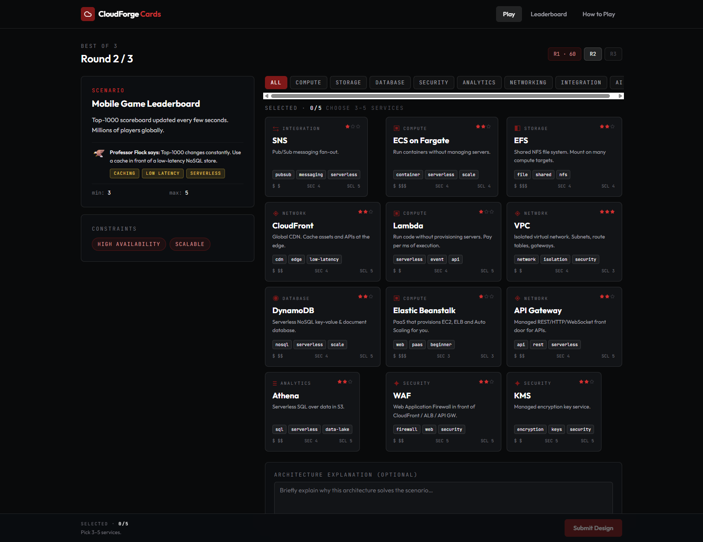
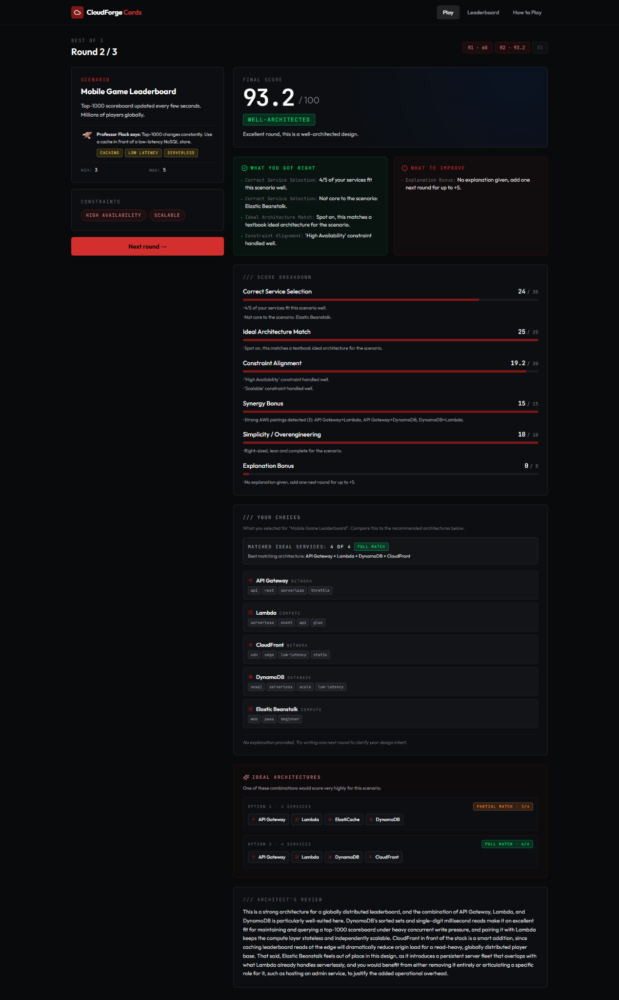
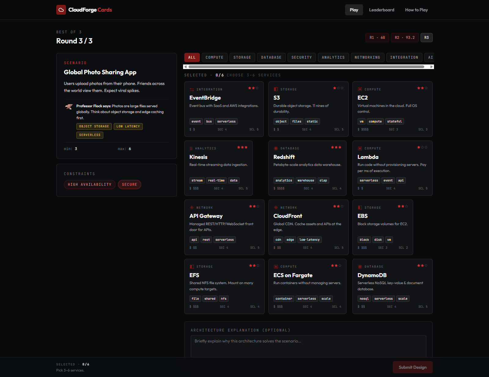
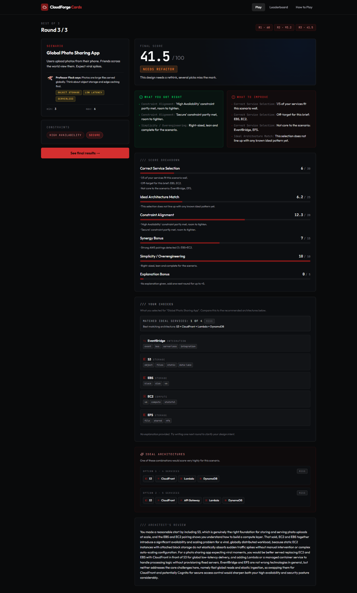
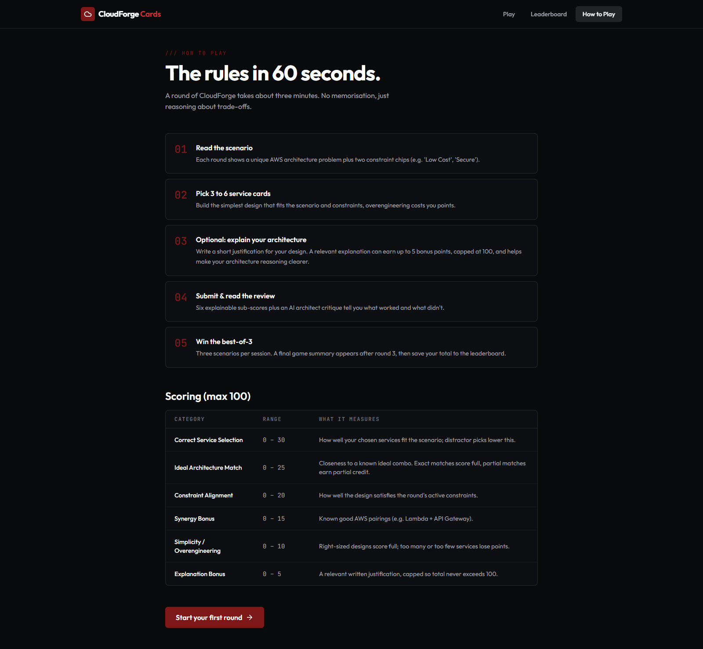
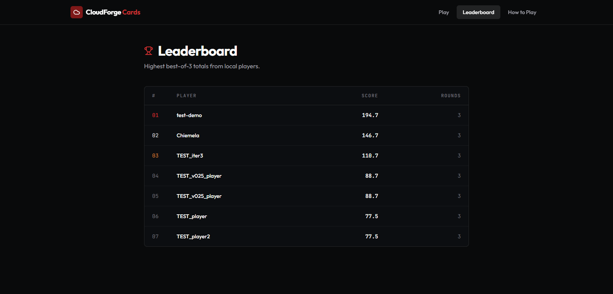

# Screenshots

These screenshots show a manual QA solo run used to verify gameplay, scoring behavior, final summary, and leaderboard flow. The different scores are test examples across scenarios and should not be interpreted as a formal assessment of the creator's AWS knowledge.

---

## v0.2.5 Screenshots

### Landing Page

---

### Round 1: Play Screen

---

### Round 1: Score Breakdown

---

### Round 2: Play Screen

---

### Round 2: Score Breakdown

---

### Round 3: Play Screen

---

### Round 3: Score Breakdown

---

### Final Game Summary

---

### Leaderboard

---

### How to Play

---

### Duplicate Leaderboard Name Reference

---

## Naming Convention

Use descriptive lowercase filenames with hyphens:

- `landing-page.png`
- `round-1-play-screen.png`
- `round-1-score-breakdown.png`
- `final-game-summary.png`
- `leaderboard.png`
- `how-to-play.png`

---

## Best Screenshots for GitHub and LinkedIn

For a **GitHub repo card or social preview**, use:
- `landing-page.png` (shows the brand and dark-theme design)
- `final-game-summary.png` (shows a completed game with scoring context)

For a **LinkedIn portfolio post**, use:
- `round-1-play-screen.png` (shows active gameplay with service cards and scenario)
- `round-1-score-breakdown.png` (shows the transparent scoring system)
- `leaderboard.png` (shows the competitive element)

---

## Guidelines

- Capture at 1280x800 or higher resolution
- Use the dark theme (default) for all screenshots
- Do not include browser chrome (address bar, tabs) in screenshots
- Optimize file size (PNG for UI, JPEG for photographic backgrounds)
- Do not fabricate or mockup screenshots; only use real application captures
